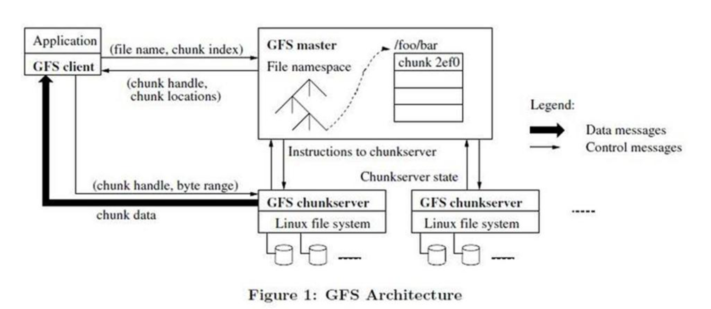

# File System

1. 首先组件失效被认为是**常态事件**而不是意外事件

2. 其次，以通常的标准衡量，我们的文件**非常巨大**。数 GB 的文件非常普遍，采用管理数亿个 KB 大小的小文件的方式是非常不明智的，尽管有些文件系统支持这样的管理方式

3. 第三，绝大部分文件的修改是**采用在文件尾部追加数据**，而不是覆盖原有数据的方式。对文件的随机写入操作在实际中**几乎不存在**

4. 系统必须持续监控自身的状态，它必须将组件失效作为一种常态，能够迅速地侦测、冗余并恢复失效的组件。

5. 一个 GFS 集群包含一个单独的 Master 节点3、多台 Chunk 服务器，并且同时被多个客户端访问，如图 1所示。

   

6. Master 节点管理所有的文件系统元数据。关于元数据的概念[看这里](http://www.ruanyifeng.com/blog/2007/03/metadata.html)

7. 无论是客户端还是 Chunk 服务器都不需要缓存文件数据。客户端缓存数据几乎没有什么用处，因为大部
   分程序要么以流的方式读取一个巨大文件，要么工作集太大根本无法被缓存。Chunk 服务器不需要缓存文件数据的原因是，Chunk 以本地文件的方式保存，Linux 操作系统的文件系统缓存会把经常访问的数据缓存在内存中

8. 操作日志包含了关键的元数据变更历史记录。这对 GFS 非常重要。这不仅仅是因为操作日志是元数据唯
   一的持久化存储记录，它也作为判断同步操作顺序的逻辑时间基线。Master 服务器在灾难恢复时，通过**重演操作日志**把文件系统恢复到最近的状态。

9. Master 服务器在日志**增长到一定量时对系统状态做一次 Checkpoint**，将所有的状态数据写入一个 Checkpoint 文件。在灾难恢复的时候，Master 服务器就通过从磁盘上读取这个Checkpoint 文件，以及重演 Checkpoint 之后的有限个日志文件就能够恢复系统

10. Chunk 的副本有三个用途:Chunk 创建，重新复制和重新负载均衡。

11. GFS 在文件删除后不会立刻回收可用的物理空间。GFS 空间回收采用惰性的策略，只在文件和 Chunk 级的常规垃圾收集时进行。我们发现这个方法使系统更简单、更可靠	

12. 虽然分布式垃圾回收在编程语言领域是一个需要复杂的方案才能解决的难题，但是在 GFS 系统中是非常简单的。我们可以轻易的得到 Chunk 的所有引用:它们都只存储在 Master 服务器上的文件到块的映射表中。我们也可以很轻易的得到所有 Chunk 的副本:它们都以 Linux 文件的形式存储在 Chunk 服务器的指定目录下。所有 Master 节点不能识别的副本都是“垃圾”。

13. 不能完全依赖机器的稳定性，也不能完全相信硬盘的可靠性

14. 在 GFS 集群的数百个服务器之中，在任何给定的时间必定会有些服务器是不可用的。我们使用两条简单但是有效的策略保证整个系统的高可用性:**快速恢复**和**复制**。

15. GFS 并**没有**在文件系统层面提供任何 Cache 机制。我们主要的工作在单个应用程序执行的时候**几乎不会重复读取数据**，因为它们的工作方式要么是流式的读取一个大型的数据集，要么是在大型的数据集中随机 Seek 到某个位置，之后每次读取少量的数据。

# 心得

1. 不是所有分布式的东西去中心化都是很好的思想，要结合实际的情况，GFS的中心化设计就是一个很好的例证
2. 感觉GFS和Dubbo或者其他类似的东西有点像
3. 改变思想，很多微观的东西放在宏观中就显得不那么要紧了，比如服务器宕机之类的