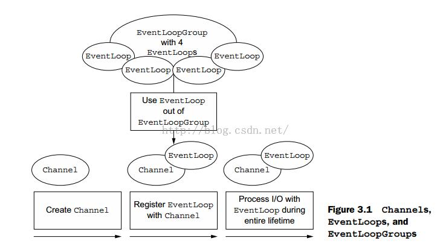

## Channel，EventLoop和ChannelFuture

- Channel ——Socket
- EventLoop——控制流，多线程处理，并发
- ChannelFuture——异步通知

### Channel

底层网络传输 API 必须提供给应用 I/O操作的接口，如读，写，连接，绑定等等。对于我们来说，这是结构几乎总是会成为一个“socket”。 Netty 中的接口 Channel 定义了与 socket 丰富交互的操作集：bind, close, config, connect, isActive, isOpen, isWritable, read, write 等等。 Netty 提供大量的 Channel 实现来专门使用。这些包括 AbstractChannel，AbstractNioByteChannel，AbstractNioChannel，EmbeddedChannel， LocalServerChannel，NioSocketChannel 等等

### EventLoop

下图在高层次上说明了Channel，EventLoop，Thread以及EventLoopGroup的关系

这些关系包括：

1. 一个EventLoopGroup包含一个或多个EventLoop
2. 一个EventLoop在一个生命周期中只和一个Thread绑定
3. 所有EventLoop处理的I/O事件都将在它专有的Thread上被处理
4. 一个Channel在其生命周期里只注册于一个的EventLoop
5. 一个EventLoop给可以被分配多个channel

### ChannelFuture

正如我们已经解释过的那样，所有的I/O操作在Netty中操作是异步的，因为操作结果并不会立即返回，我们需要通过一个方法在之后的某个时间里确定结果，出于这个目的，Netty提供了ChannelFuture，它的addListener()方法注册一个channelFutureListener，以便在某个操作完成时（无论是否成功）得到通知

> 我们可以将ChannelFuture当成一个操作在未来返回的结果的一个占位符，虽然在执行的时候，无法精确的预测它的结果，因为它返回的结果取决于一些未知的因素，但是有一点可以肯定，结果肯定会被执行到，不管是对是错，还有一点可以保证，所有属于同一个Channel的操作可以保证按照它调用的顺序被执行

## ChannelHandler和ChannelPipeline

