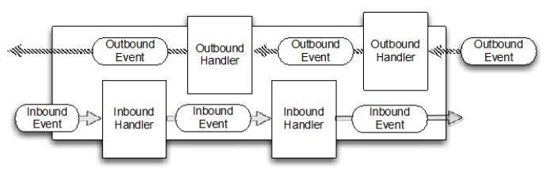

# Netty的核心组件

### Channel

> 它代表一个到实体（如一个硬件设备，一个文件，一个网络套接字活着一个能够执行一个活着多个不同的I/O操作的程序组件）的开放连接，如读操作和写操作

目前可以把Channel看作是传入（入站）或者传出（出站）数据的载体。因此，它可以被打开活着被关闭，连接或者断开连接

### 回调

一个回调骑士就是i 一个方法，一个指向已经被提供给另外一个方法的方法的引用。这使得后者可以在适当的时候调用前者。回调在广泛的编程场景中都有应用，而且也是在操作完成后通知相关方最常见的方式之一

### Future

Future 提供了另外一种通知应用操作已经完成的方式。这个对象作为一个异步操作结果的占位符,它将在将来的某个时候完成并提供结果。

JDK 附带接口 java.util.concurrent.Future ,但所提供的实现只允许您手动检查操作是否完成或阻塞了。这是很麻烦的，所以 Netty 提供自己了的实现,ChannelFuture,用于在执行异步操作时使用。

ChannelFuture 提供多个附件方法来允许一个或者多个 ChannelFutureListener 实例。这个回调方法 operationComplete() 会在操作完成时调用。事件监听者能够确认这个操作是否成功或者是错误。如果是后者,我们可以检索到产生的 Throwable。简而言之, ChannelFutureListener 提供的通知机制不需要手动检查操作是否完成的。

每个 Netty 的 outbound I/O 操作都会返回一个 ChannelFuture;这样就不会阻塞。这就是 Netty 所谓的“自底向上的异步和事件驱动”。

### 事件和ChannelHandler

Netty 使用不同的事件来通知我们更改的状态或操作的状态。这使我们能够根据发生的事件触发适当的行为。

这些行为可能包括：

- 日志
- 数据转换
- 流控制
- 应用程序逻辑

由于 Netty 是一个网络框架,事件很清晰的跟入站或出站数据流相关。因为一些事件可能触发传入的数据或状态的变化包括:

- 活动或非活动连接
- 数据的读取
- 用户事件
- 错误

出站事件是由于在未来操作将触发一个动作。这些包括:

- 打开或关闭一个连接到远程
- 写或冲刷数据到 socket

每个事件都可以分配给用户实现处理程序类的方法。这说明了事件驱动的范例可直接转换为应用程序构建块。

下图显示了一个事件可以由一连串的事件处理器来处理

# 整合

#### FUTURE, CALLBACK 和 HANDLER

Netty 的异步编程模型是建立在 future 和 callback 的概念上的。所有这些元素的协同为自己的设计提供了强大的力量。

拦截操作和转换入站或出站数据只需要您提供回调或利用 future 操作返回的。这使得链操作简单、高效,促进编写可重用的、通用的代码。一个 Netty 的设计的主要目标是促进“关注点分离”:你的业务逻辑从网络基础设施应用程序中分离。

#### SELECTOR, EVENT 和 EVENT LOOP

Netty 通过触发事件从应用程序中抽象出 Selector，从而避免手写调度代码。EventLoop 分配给每个 Channel 来处理所有的事件，包括

- 注册感兴趣的事件
- 调度事件到 ChannelHandler
- 安排进一步行动

该 EventLoop 本身是由只有一个线程驱动，它给一个 Channel 处理所有的 I/O 事件，并且在 EventLoop 的生命周期内不会改变。这个简单而强大的线程模型消除你可能对你的 ChannelHandler 同步的任何关注，这样你就可以专注于提供正确的回调逻辑来执行。该 API 是简单和紧凑。

