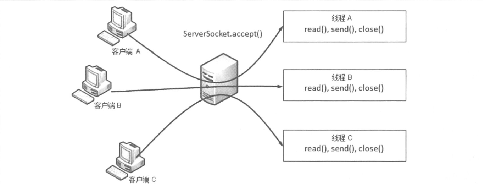
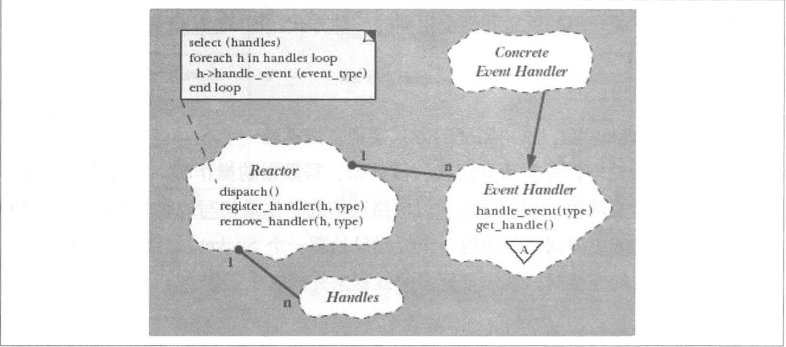
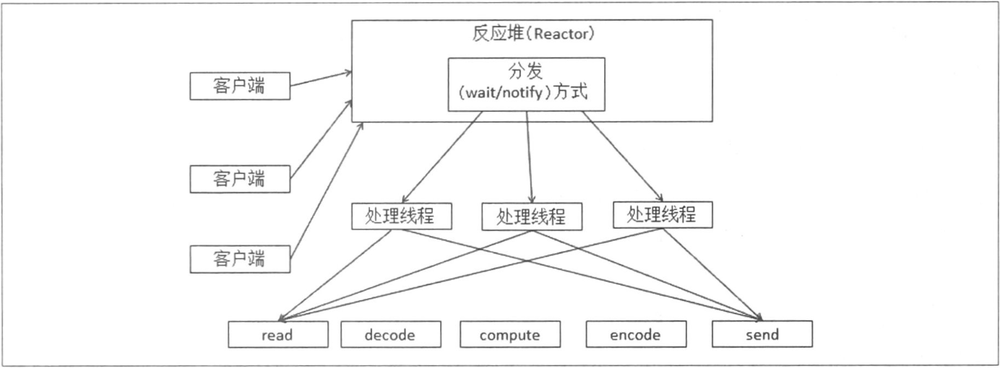

1. 分布式系统的定义：

   - 组件分布在网络计算机上
   - 组件之间仅仅通过消息传递来通信并协调行动

2. 1.2.2.3 同步陷阱

   这一小节给了一段代码：

   ```java
   public class TestClass {
       private HashMap<String, Integer> map = new HashMap<String, Integer>();
       public synchronized void add(String key){
             Integer value = map.get(key);
             if(value == null){
                 map.put(key,1);
             }else{
                map.put(key, value + 1);
             }
       }  
   }
   ```

   可以看出，这是对一个不保证线程安全的容器做写入同步。书中该代码前的语境是这样：

   > 。。。不过，需要在这里提一点的是，有时通过加锁把使用线程不安全容器的代码改为使用线程安全容器的代码时，会遇到笔者之前遇到过的一个陷阱，即在一个使用 map 存储信息后统计总数的例子中，map 中的 value 整型使用线程不安全的 HashMap 代码是这样写的。。。

   由此可见，一开始贴的代码是正确也推荐使用的。但之后作者在这贴了一段代码并叙述

   >。。。如果我们使用 ConcurrentHashMap 来替换 HashMap，并且仅仅是去掉 synchronized 关键字，那么就出问题了。问题不复杂，大家可以自己来思考答案。

   ```java
   public class TestClass {
       private ConcurrentHashMap<String, Integer> map = new ConcurrentHashMap<String, Integer>();
       public void add(String key){
             Integer value = map.get(key);
             if(value == null){
                 map.put(key,1);
             }else{
                map.put(key, value + 1);
             }
       }  
   }
   ```

   这里的 ConcurrentHashMap 是 Java 1.5 版本出的线程安全容器，采用分段锁（lock striking）做细粒度的同步，针对对并发的访问，动作的吞吐量也不至于大打折扣。

   乍一看好像没有什么不对劲的，既然选择一个线程安全容器，那么监视器可以移除也不会有什么问题吧？

   可以看出的是，这个 add 方法是个 **check then act** 的动作，而这就会造成常见的 **race condition** 。来看一段 stackoverflow 上的[解释](http://stackoverflow.com/questions/34510/what-is-a-race-condition)

   > A race condition occurs when two or more threads can access shared data and they try to change it at the same time. Because the thread scheduling algorithm can swap between threads at any time, you don't know the order in which the threads will attempt to access the shared data. Therefore, the result of the change in data is dependent on the thread scheduling algorithm, i.e. both threads are "racing" to access/change the data.
   >
   > Problems often occur when one thread does a "check-then-act" (e.g. "check" if the value is X, then "act" to do something that depends on the value being X) and another thread does something to the value in between the "check" and the "act". E.g:

   接下来也给出简洁的代码阐述这一现象：

   ```java
   if (x == 5) // The "Check"
   {
      y = x * 2; // The "Act"

      // If another thread changed x in between "if (x == 5)" and "y = x * 2" above,
      // y will not be equal to 10.
   }
   ```

   上面说，并发的访问或者更新操作，如果不加锁控制同步，那 if 内的代码的先决条件并不一定就是显式 check 的，也许其他线程已经对那个数据动了手脚。到这就很明显了.

3. 多进程相对与单进程多线程的方式说，**资源控制会更容易实现**，此外，多进程中的单个进程问题，**不会造成整体的不可用**。这两点事多进程区别于单进程多线程方式的两个特点。当然使用多进程会比多线程稍微复杂一点，多进程之间可以共享数据，但是其代价比多线程要大，会涉及到**序列化和反序列化**的开销

4. BIO：Blocking IO ，采用阻塞方式实现，这样做带来的主要问题就是一个线程只能处理一个Socket，如果是Server端，那么在支持并发的连接时，就需要更多的线程来完成这个工作 工作方式如下图所示：

   

5. NIO：即Nonblocking IO，基于事件驱动思想，采用Reactor模式，如下图：

   

   在NIO的方式下不是用单个线程去应对耽搁Socket，而是通过统一的Reactor对所有的客户端的Socket事件处理，然后派发到不同线程中。这样就解决了BIO中为了支持更多Socket而需要打开更多线程的问题。示例如下图：

   

6. AIO: AsynchronousIO，即异步IO ，与NIO的区别在于AIO进行读/写操作的时候，只需要调用相应的read/write方法，并且需要传入CompletionHandler（动作完成处理器）；动作完成后，会调用CompletionHandler，NIO的通知时发生在动作前，是在可写可读的时候，Selector发现这些事件后调用Handler处理

7. 控制器方式

   - 硬件负载均衡设备：所有请求都要经过这个负载均衡设备

   - 软件负载均衡系统：和硬件负载均衡设备功能类似，如[LVS](http://baike.baidu.com/link?url=PTcFmQMDqQdzceuTVeSCLMKWfaBjbyBcCECtD88ZAsDueznpVWAQPzNKAk_u_KcCnZ6_Yf9fTEKdoZ4mvAcYL_)

   - 使用目录服务器的方法：类似于dubbo的方式

   - 使用规则解析的方式：类似于rabbitmq的规则方式分发

   - 主从方式（Master+Worker）

     **使用目录服务器和规则解析方式可能导致任务分配不均匀，用Master节点方式会更好一些**

8. 在整个分布式系统中，如果某个角色或者功能只有在某台单机支撑，那么这个节点称为单点，其发生的故障称为单点故障，我们需要在分布式系统中尽量避免出现单点，尽量保证我们的功能都是由集群完成的