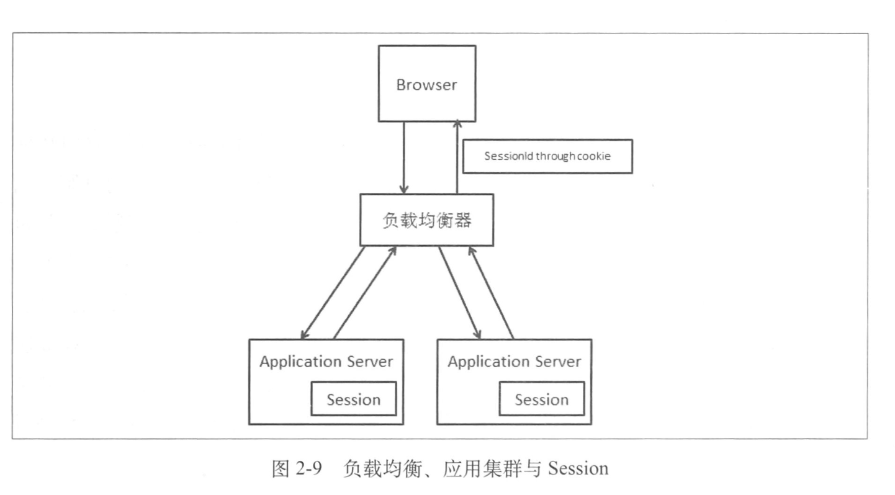
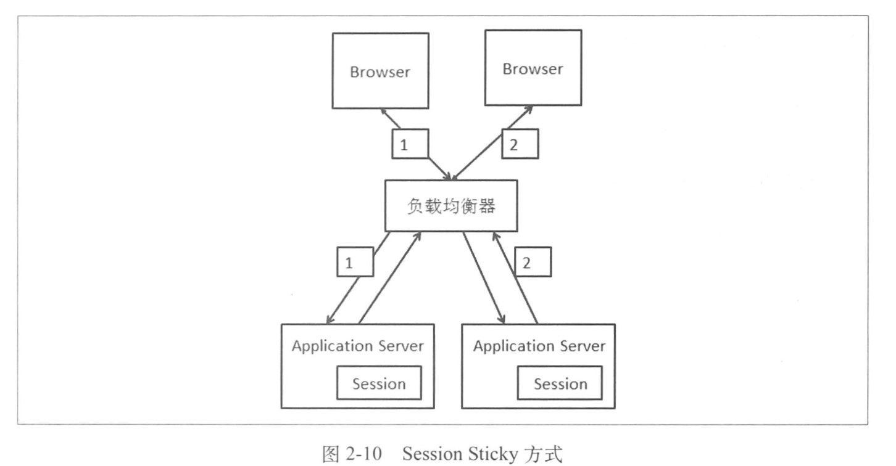
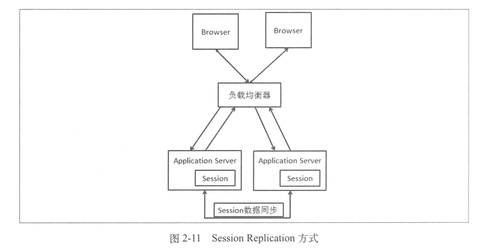
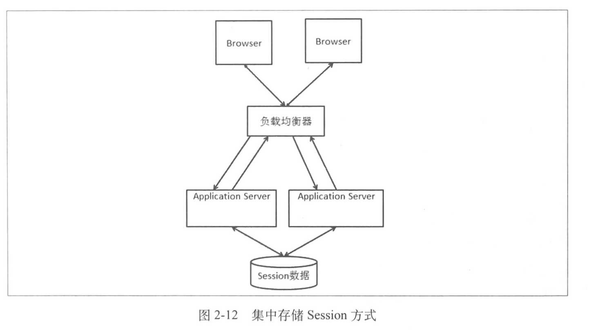
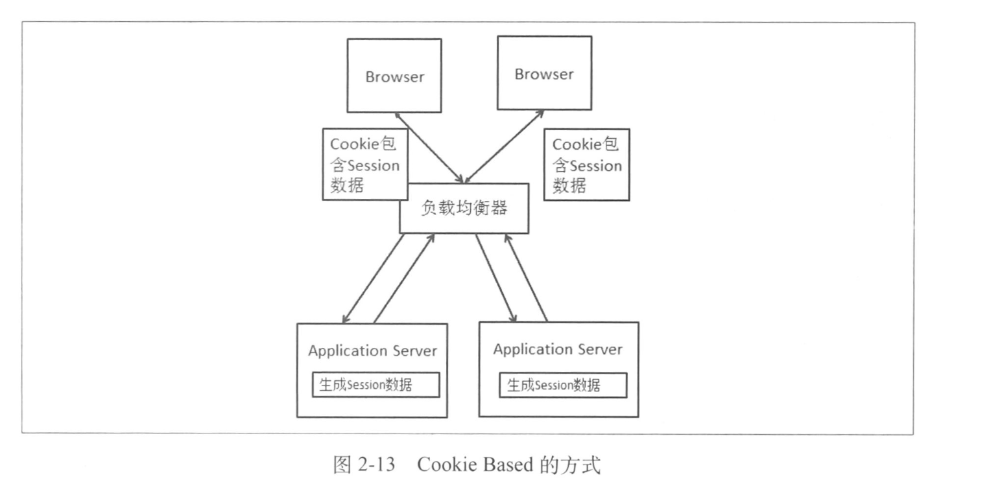
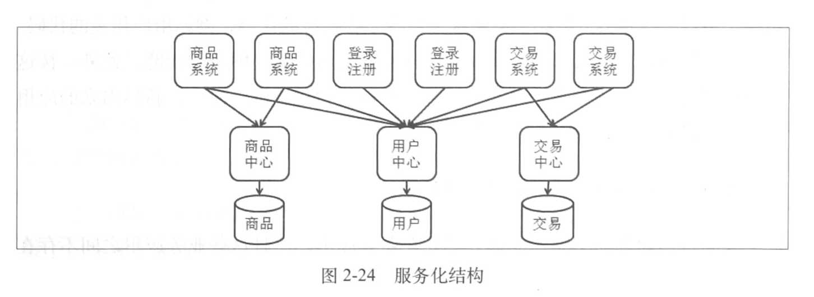

1. 应用服务器变为集群后会出现一个Session问题，如下图所示，如果我们第一次访问网站的时候请求落到了左边的服务器，那么我的Session就会创建在左边的服务器上（Session数据保存在单机上），如果不做任何处理，就不能保证接下来的请求每次都落在同一边的服务器上，这就是Session问题

   

   解决方式：

   - Session Sticky：

     这个方案很简单，在负载均衡器上做了点手脚，这个方案可以让同样Session的请求每次都发送到同一个服务器处理，不过也带来如下几个问题

     1. 如果一台Web服务器宕机或者重启，那么这台机器上的会话数据就会丢失，如果有登录状态的信息，那么用户就要重新登录。
     2. 绘画表示时应用层的信息，那么负载均衡器窑将同一个会话的请求都保存到同一个Web服务器上的话，就需要进行应用层的解析，这个开销较大
     3. 负载均衡器变成了一个有状态的节点，要将会话保存到具体Web服务器的映射。和无状态的节点相比，内存消耗会更大，荣宰方面会更麻烦

     

   - Session Replication

     这个也比较简单，就是在所有的Web服务器上同步Session的数据：

     

     这个方案也会有一些比较严重的问题：

     1. 同步Session数据造成了网络带宽的开销，只要Session数据变化，就需要同步，机器数越多，开销越大
     2. 每台Web服务器都要保存所有的Session数据，如果整个集群Session数很多的话，每台机器用于保存Session数据的内容占用会很严重

   - Session数据集中存储

     结构如图所示：

     

     存在的问题：

     1. 读写Session数据引入了网络操作，这相对于本机的数据读取来说，问题就在与存在时延和不稳定性，不过我们的痛心几本发生在内网，问题不大
     2. 如果集中存储Session的机器或者集群出现问题会影响我们的应用

   - Cookie Based

     每次访问都携带Cookie的数据包，如下图

     

     问题：

     1. Cookie长度限制
     2. 安全性
     3. 带宽消耗：这里指的不是内部Web服务器之间的带宽消耗，而是我们数据中心的整体外部带宽的消耗
     4. 性能影响：对于Web服务器来说，在同样的处理情况下，响应的结果输出越少，支持的并发请求就会越多

   - 小结

     大型网站中 Session Sticky 和 Session数据集中存储是比较好的方案。

2. 读写分离

   提到读写分离，我们更多地想到数据库层面。事实上，广义的读写分离可以扩展到更多的场景。我们看一下读写分离的特点。简单来说就是原有读写设施的基础上增加了读“库”，更合适的说法应该是增加了读“源”，因为它不一定是数据库而只是提供了读服务，分担原来读写库中读的压力，因为我们增加的是一个读“源”，所需要解决的是向这个“源”复制数据的问题

3. 走服务化的道路

   

   ​