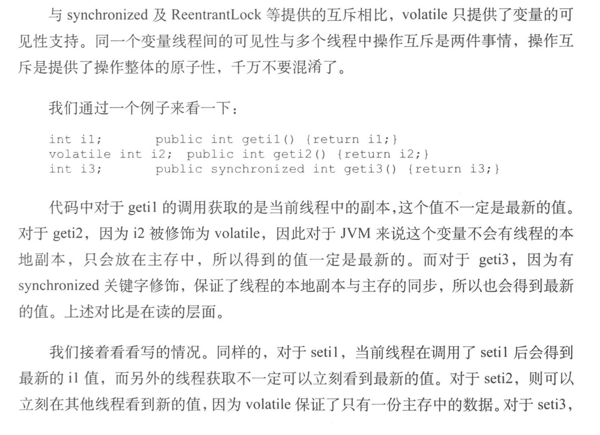
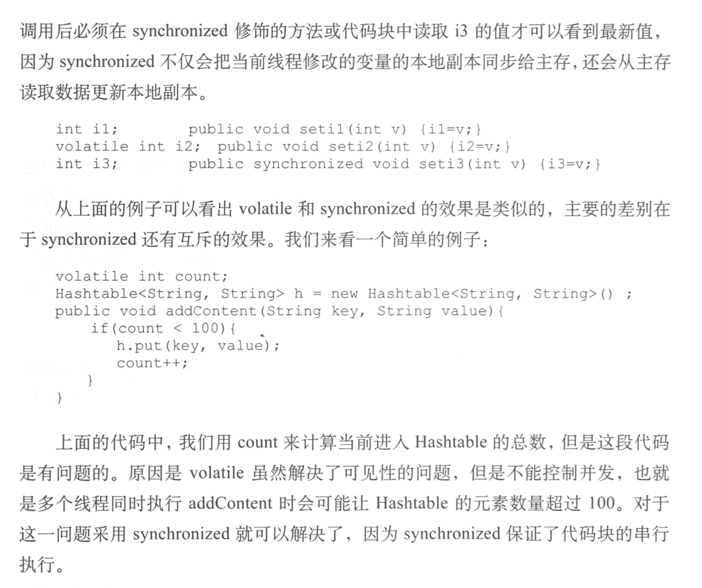

1. 使用线程池的时候，需要注意的是**Executors.newCachedThreadPool()**方法返回的饿线程池的使用，该方法返回的线程池是没有线程上限的，在使用时一定要当心，因为**没有办法控制总体**的线程数量，而每个线程都是消耗内存的，这可能会导致过多的内存被占用，建议尽量不要用这个方法返回线程池，而使用有固定线程上限的线程池

2. synchronized除了有互斥作用外，还有**可见性**的作用。synchronized保证了**synchronized块中变量**的可见性，而volatile保证了所修饰变量的可见性

   

   

3. CopyOnWrite的思路是在更改容器的时候，把容器写一份进行修改，保证正在读的线程不会受到影响，这种方式用在读多写少的场景中会很不错，因为实质上是在写的时候重建了一次容器。Concurrent开头的容器具体实现方式则不完全相同，总体来说就是尽量保证读不加锁，并且修改时不影响读，所以回答道比使用读写锁更高的并发性能