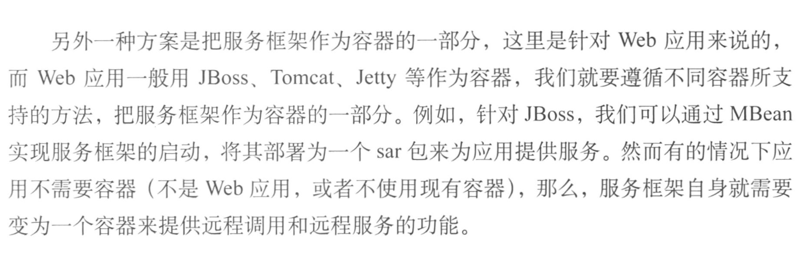
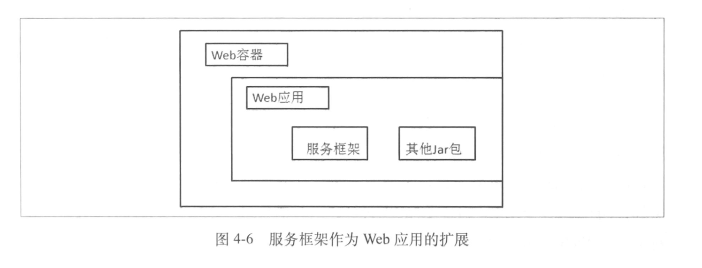
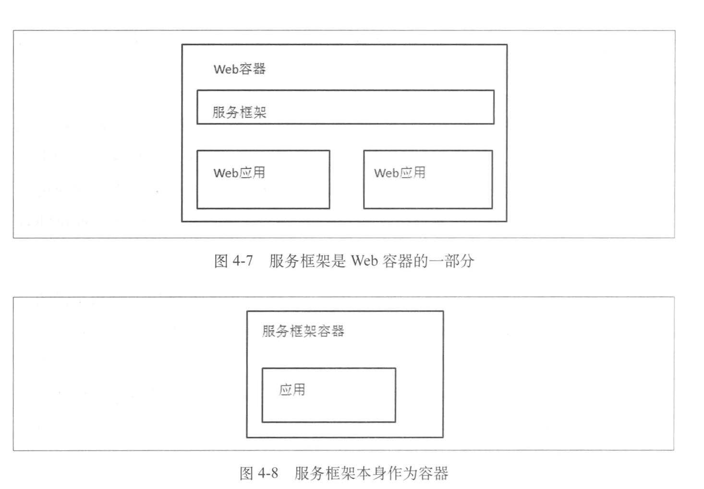
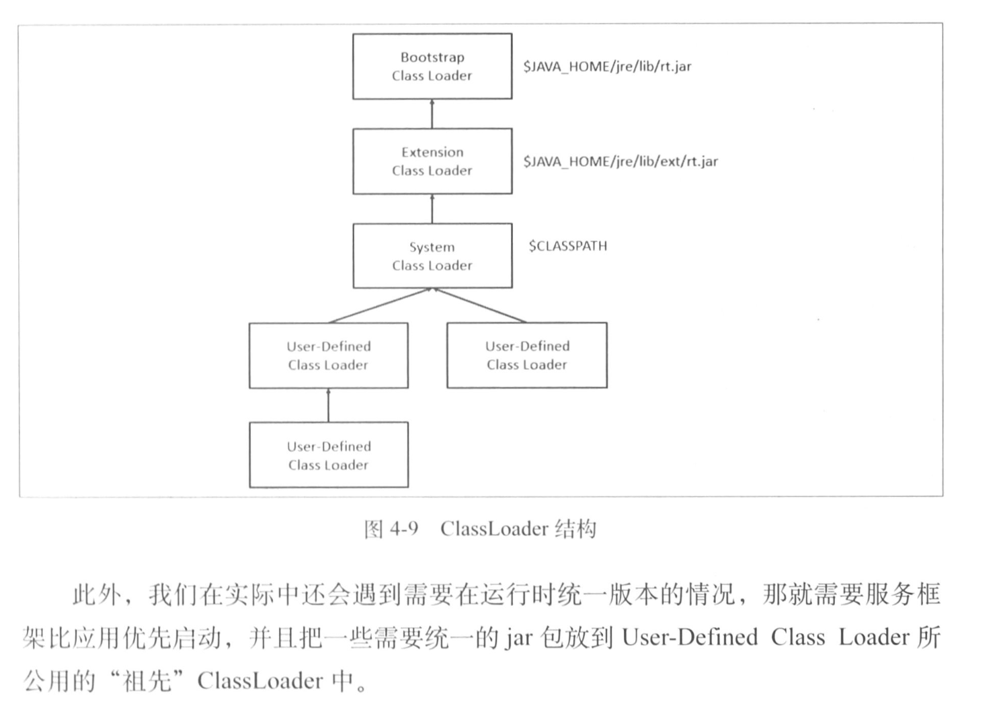
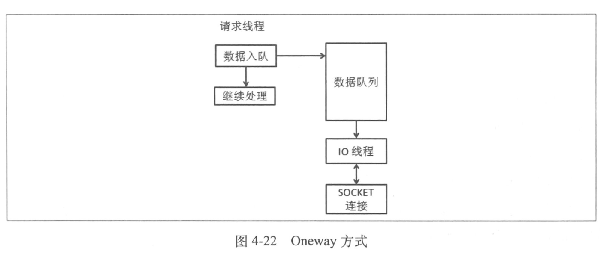
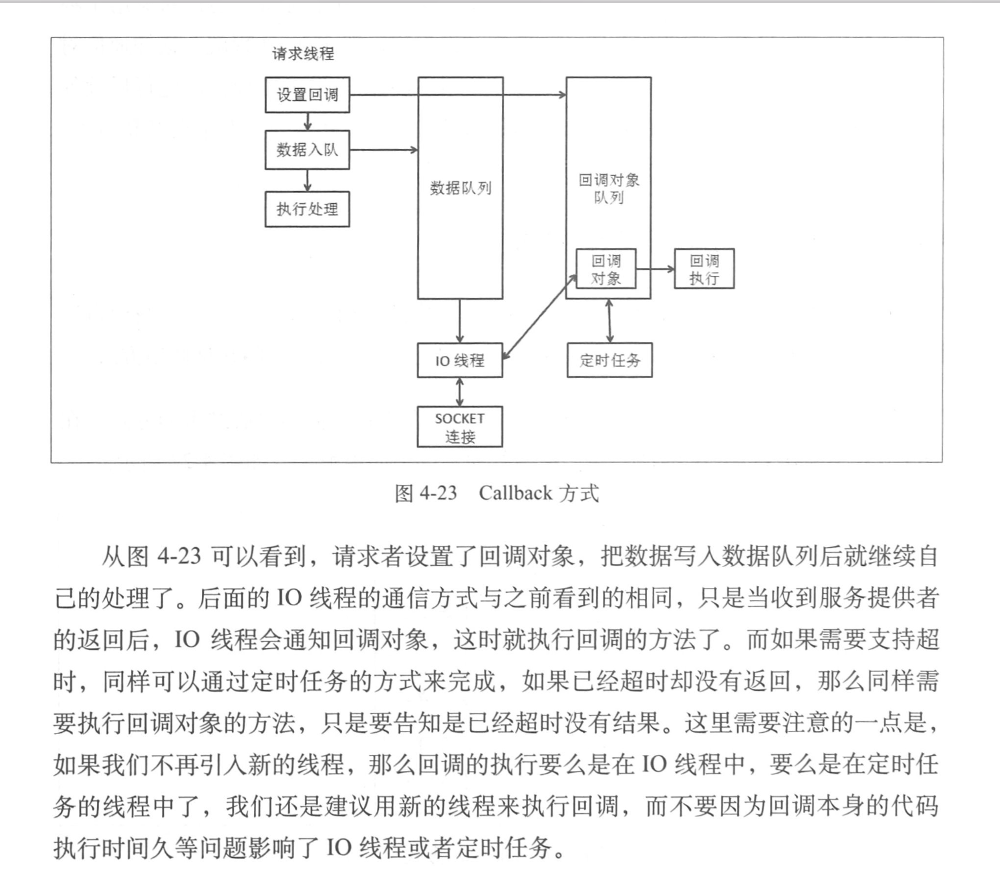
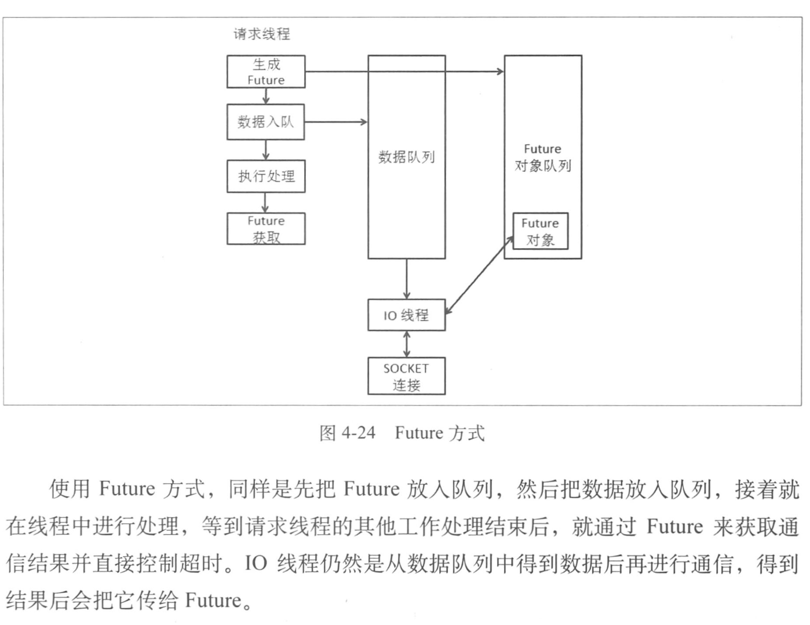
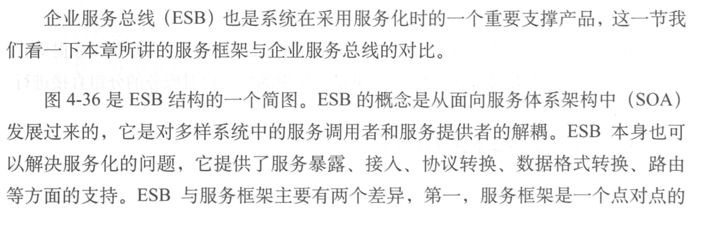
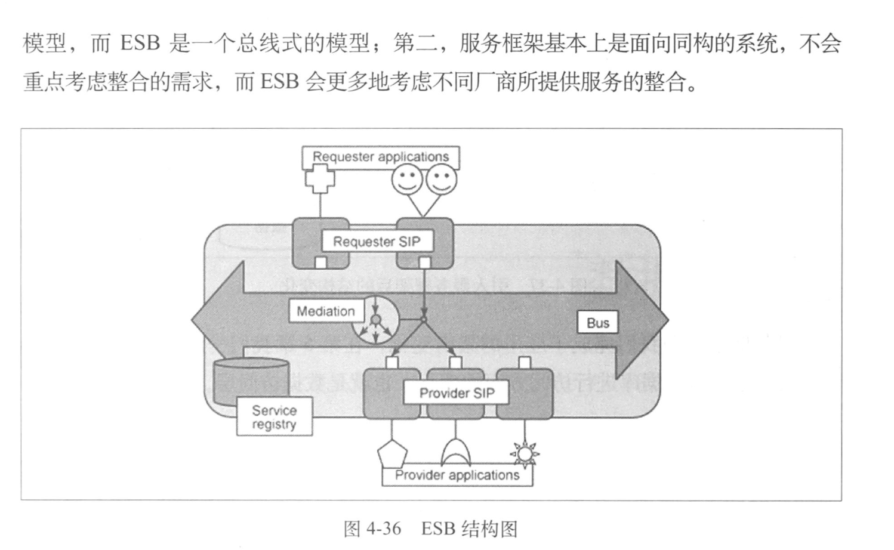

1. 服务框架接入有两个很重要的问题要解决

   - 服务框架自身的部署方式问题

     1. 把服务框架作为应用的一个依赖包与应用一起打包，升级框架的时候会出现较多问题

     2. 把服务框架作为容器的一部分

        

        

        

   - 实现自己的服务框架所依赖的jar包与应用自身依赖的jar包之间的冲突问题

     

     

2. 负载均衡实现策略的选择：随机，轮询，权重，其中权重方式一般是指动态权重的方式，可以根据响应时间等参数进行计算。在服务提供者的机器能力对等的情况下，随机和轮询比较容易实现，不对等的情况下使用权重方式

3. 多种异步服务调用的方式：

   - Oneway：Oneway是一种只管发送请求而不关心结果的方式如下图：

     

     Oneway方式不关心对方是否受到了数据，也不关心对方收到数据后做什么或有什么返回，这几本等价于一个不保证可靠送达的通信

   - Callback：这种方式下请求方发送请求后会继续执行自己的操作，等待对方响应的时候进行一个回调

     

   - Future

     

   - 可靠异步：可靠异步要保证异步请求能够在远程被执行，一般是通过消息中间件完成这个保证的

   - Oneway是一个单向通知；Callback是回调，是一种很被动的方式，Callback的执行不是在原请求线程中；而Future是一种能够主动控制超市，获取结果的方式，并且执行仍然在原请求线程中；

   - 可靠异步方式能够保证异步请求在远程被执行

4. 当需要对服务升级的时候指定版本号是一个不错的升级手段

5. 服务框架与ESB的对比

   

   

   ​

