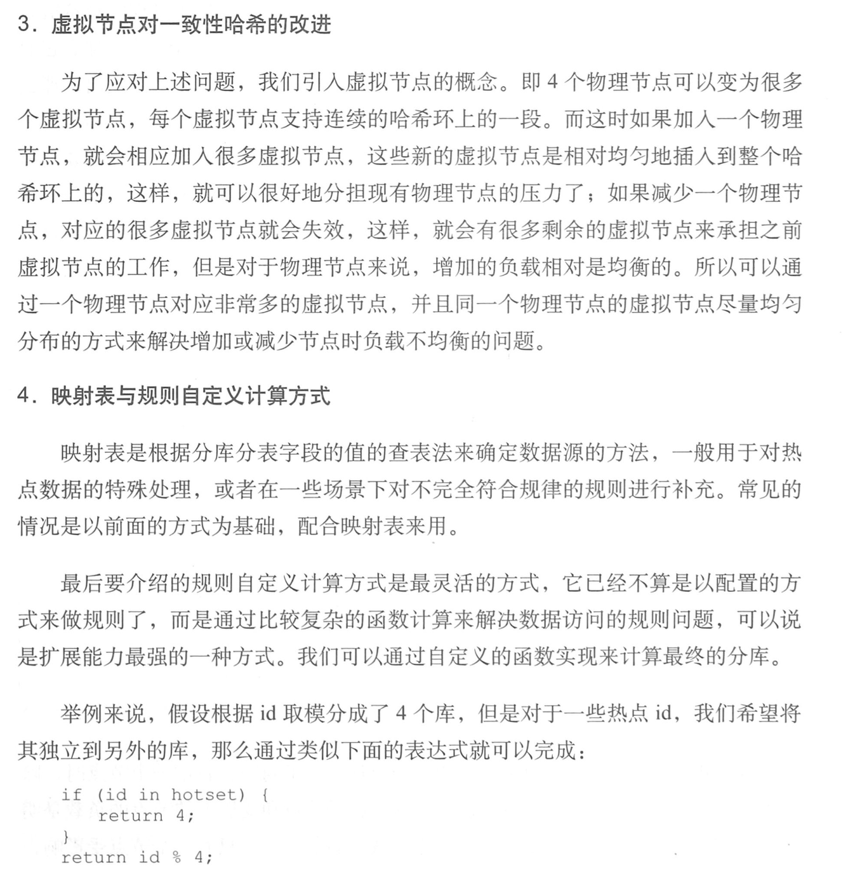

1. 大型网站一致性的理论基础-CAP／BASE

   

   

    

2. 分布式事务可以通过两阶段提交来实现

3. 分库分表的情况下使用JDBC的效果最好

4. 按照数据流程设计数据层：

   

   - SQL解析：得到SQL中的关键字内容，一个很重要的事是得到需要操作的表，根据参数及规则来确定目标数据源连接

   - 规则处理阶段：

     1. 采用固定哈希作为规则

        

     2. 一致性哈希

        

        

5. 数据库平滑迁移

   

   

   

   ​