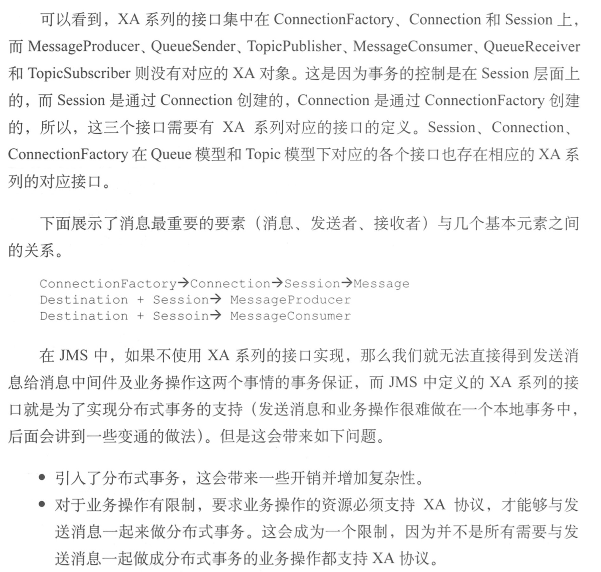
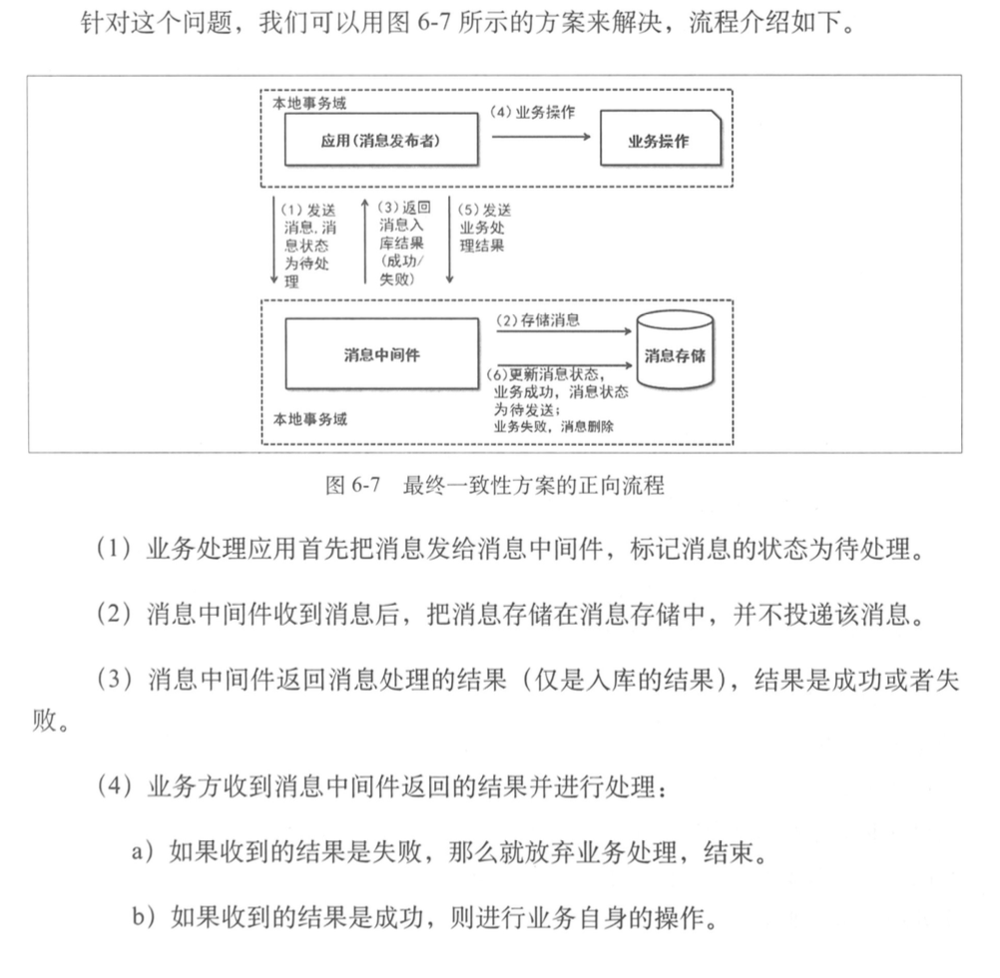
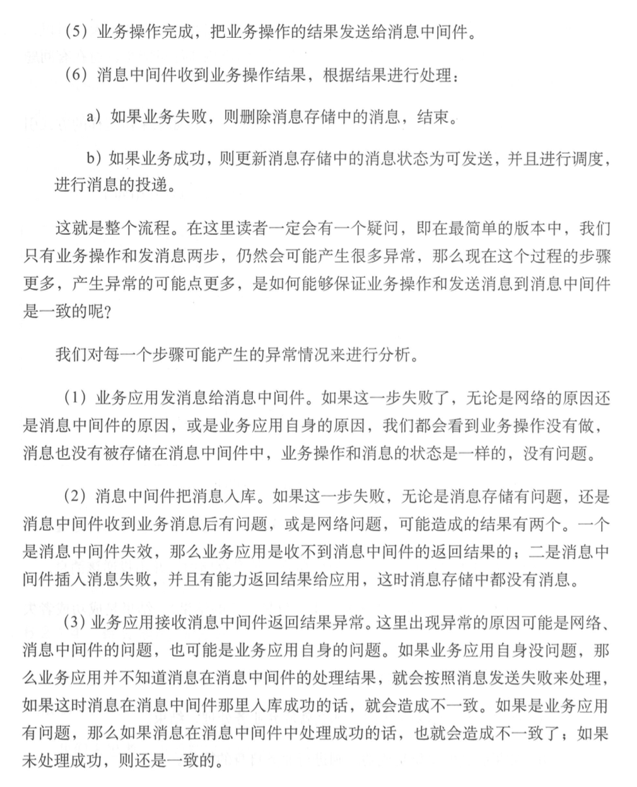
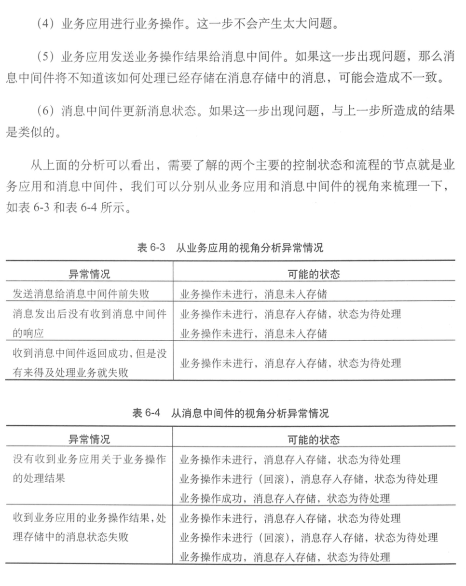
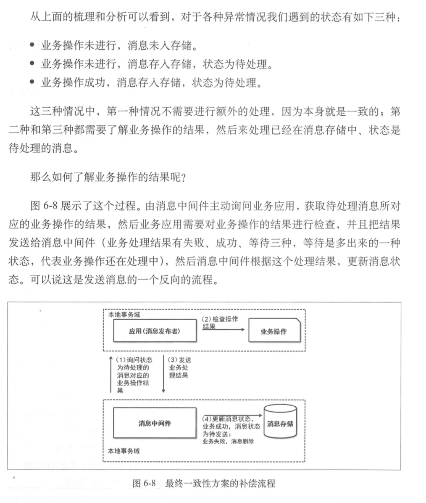
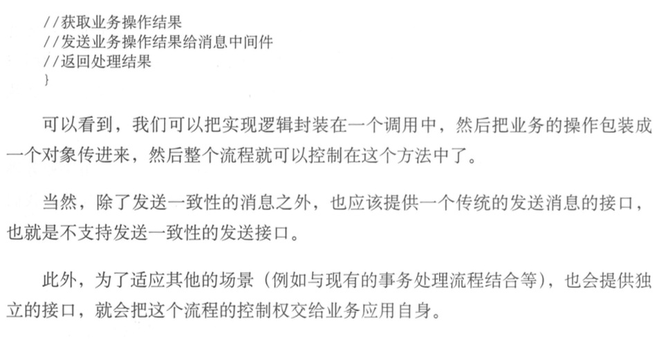
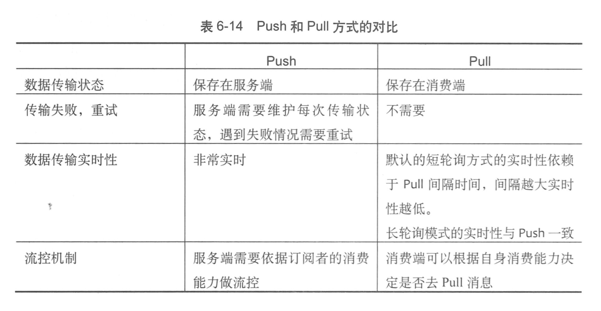

1. 如何解决消息发送一致性：

   **什么是消息发送一致性**：产生消息的业务动作与消息发送的一致，就是说，如果业务操作成功了，那么这个操作产生的消息一定要发送出去。否则就是丢失消息了，另一方面，如果这个业务行为没有发生或是失败，就不应该发送消息

   **JMS相关**：

   

   **较好的解决思路**

   

   

   

   

   

   

2. 在大型网站的实践中很多时候不会遵循数据库范式的设计更多的是考虑采用宽表冗余数据的方式来实现

3. Push和Pull的区别：

   

   ​

   ​