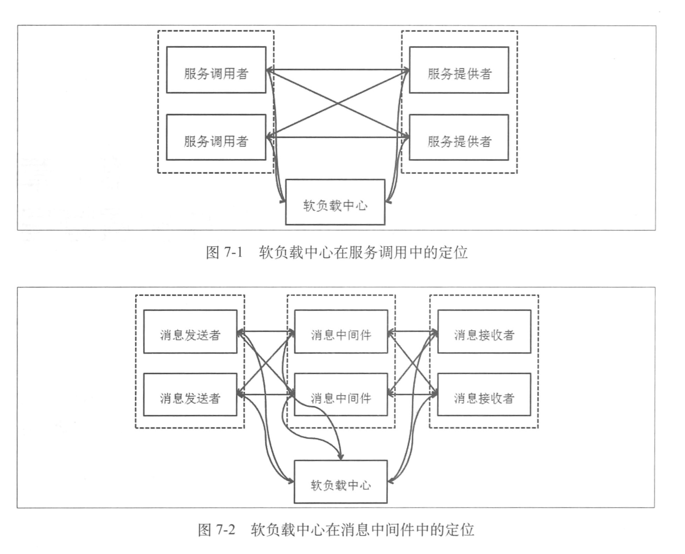
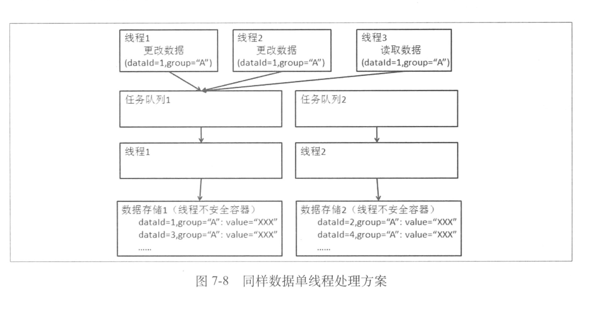
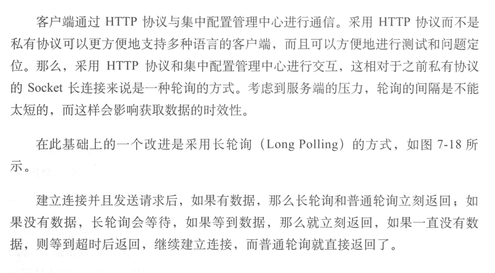
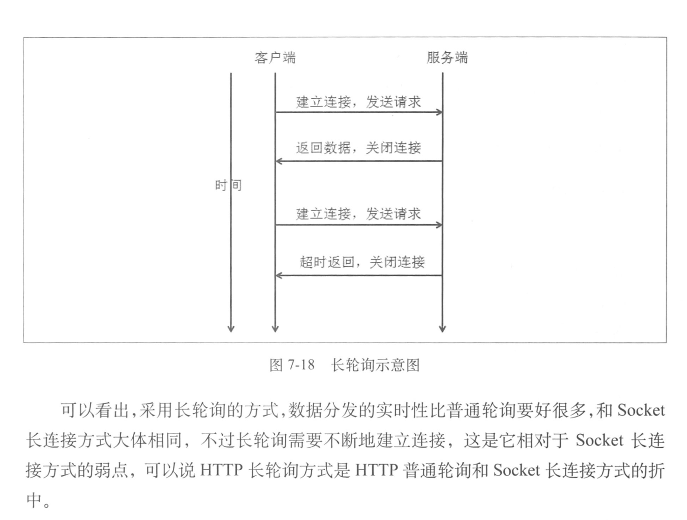

1. 软负载中心的定位：

   

2. 软负载中心的职责：

   - 聚合地址信息，如服务提供者的地址，消息中间件系统中的消息中间件应用地址

     1. 并发下保证数据正确性：使用线程安全容器，如ConcurrentHashMap

     2. 数据更新，删除顺序保证：使用NIO方式通信，并在删除数据前保证数据存在

     3. 当有大量数据读写的时候一种不加锁提升性能的方案就是使用任务队列如图所示

        

        这样就无需加锁了，只需要按照任务顺序取出任务和放入任务即可

   - 生命周期感知，需要对服务上下线自动感知

     1. 通过客户端与服务端的连接感知：对于服务提供者来说，软负载中心可以通过长连接上的心跳或数据的发布来判断服务提供者是否还在线，但是负载高的情况下容易误判
     2. 通过对于发布数据中提供的地址端口进行连接检查：当通过长连接判定服务应用已经下线的时候，不直接认定这个服务已经下线，而是交给另外一个独立的监控应用去验证这个服务是否已经不在了，方式一般是通过之前发布的地址，端口进行一下连接的验证，如果不能连接，则判定下线，存在的问题就是网络问题

3. 数据分发和消息订阅的区别

   1. 消息中间件需要保证消息不求事，每条消息都应该送到相关的订阅者，而软负载中心只需要保证最新数据送到相关的订阅者，不需要保证每次的数据变化都能让最终订阅者感知
   2. 第二个差别就是关于订阅者的集群，也就是订阅者的分组。在消息中间件中，同一个集群中的不同机器分享所有的消息，因为这个消息只要同一集群中的一台机器去处理就行了，而软负载中心则不同，因为软负载中心维护的是大家都需要的服务数据，所以把这个数据分发给所有的机器。这也是消息中间件与软负载中心在数据分发方面的不同

4. 集中管理配置的客户端实现

   

   

   ​

