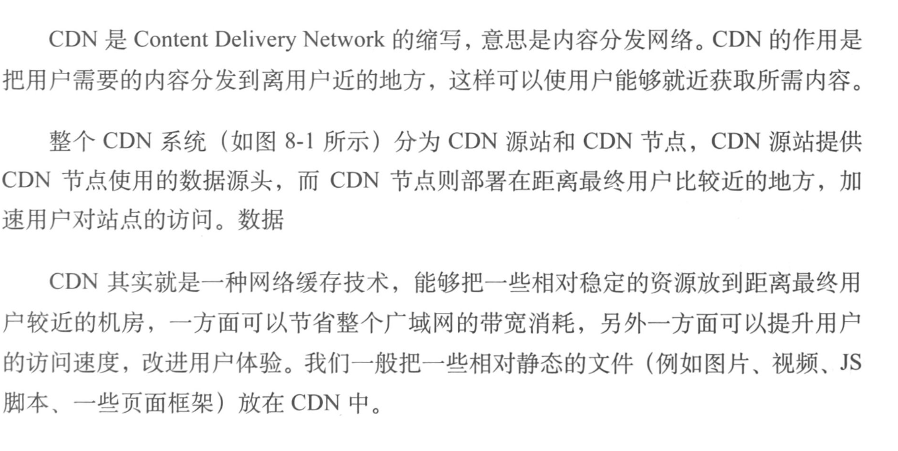
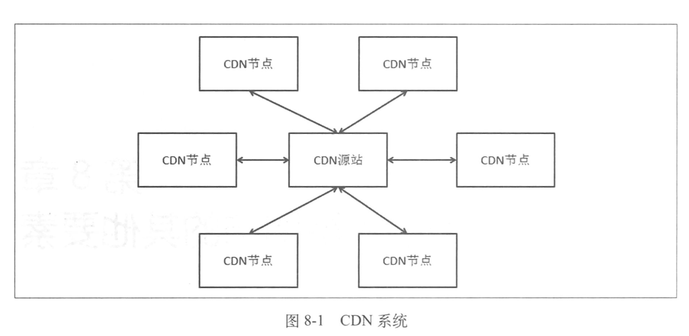
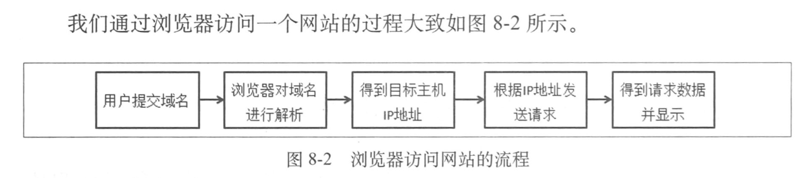
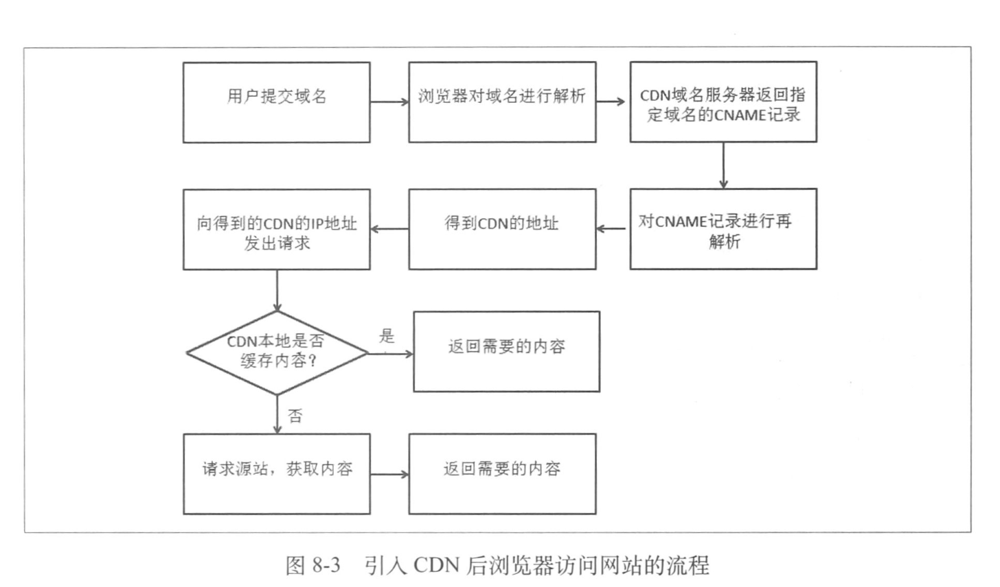
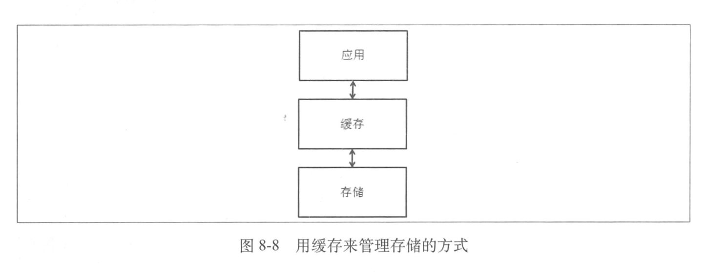
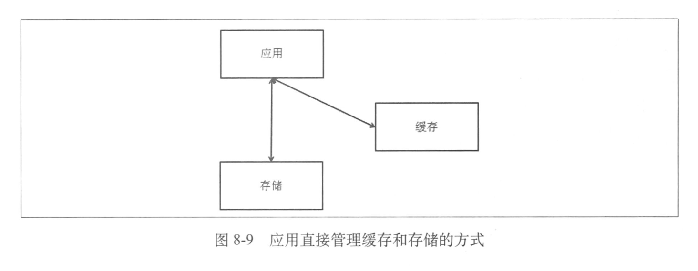
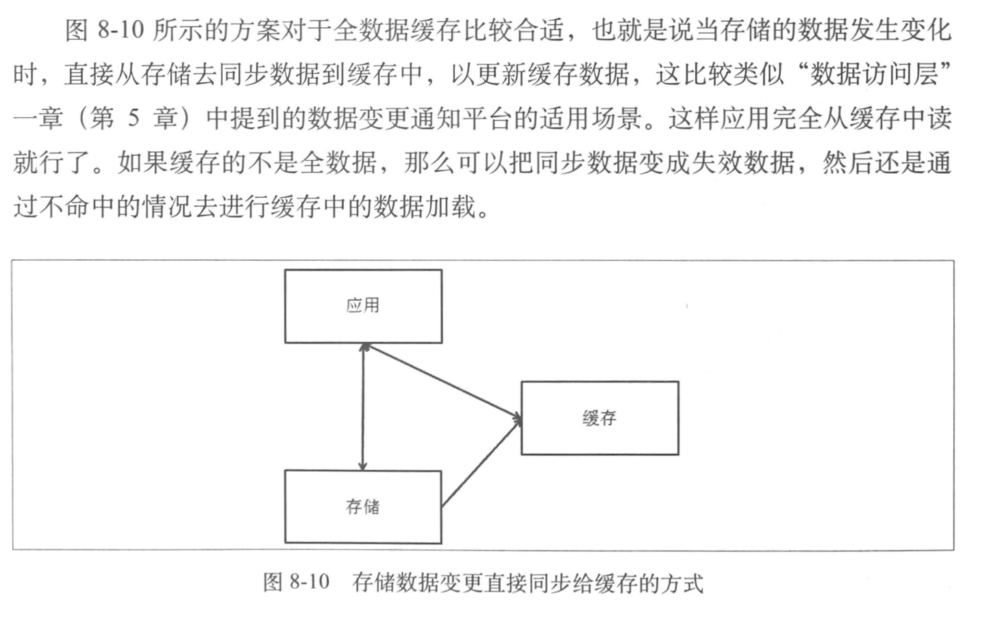
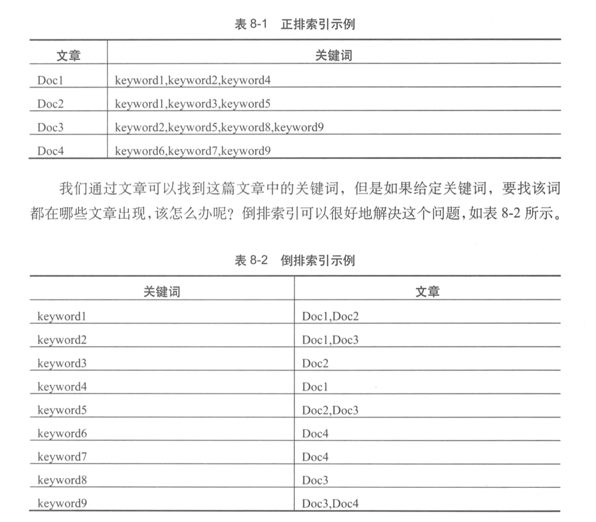
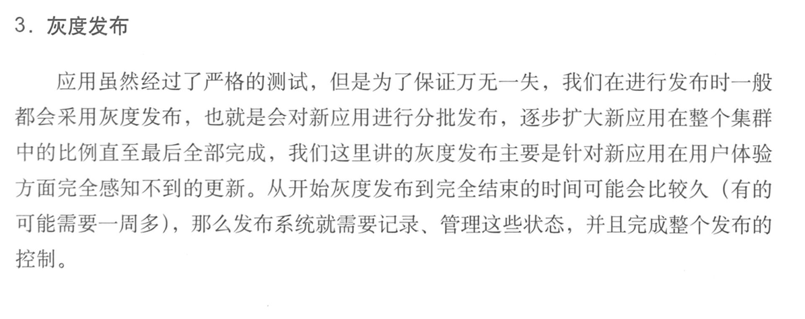

1. 加速静态内容访问速度的CDN

   

   

   

   有了CDN之后访问过程会发生一些变化

   

   几个关键技术：

   - 全局调度
   - 缓存技术
   - 内容优化
   - 带宽优化

2. 分布式文件系统

   - TFS（淘宝的分布式文件系统，开源）
   - GFS（Google File System，不开源）
   - HDFS（采用Java的类GFS实现）

3. NoSQL

   - Key-Value：缺点：无法进行高效的范围查询
   - Ordered Key-Value ：在多个应用中去使用的话，不直观也不方便
   - BigTable：结构化数据的分布式存储系统
   - Document Full-Text Search ：Value中任意自定义复杂的Scheme，不在是Map嵌套，对索引的支持
   - Graph ：主要是支持图结构的数据模型

4. 缓存系统

   两个使用缓存的场景

   

   这种方式中，应用不直接操作存储的，存储由缓存来控制。对于应用的逻辑来说这很简单，但是对于缓存来说，因为需要保证数据写入缓存后能够存入存储中，所以缓存本身的逻辑会复杂，需要很多操作日志以及故障恢复

   

   这种方式中，应用直接与缓存和存储交互，一般的做法是应用在写数据时更新存储，然后失效缓存；而在读数据时首先读缓存，如果缓存中没有数据，那么再去读存储，并且把数据写入缓存

   

   ESI技术：通过在返回的页面上加上特殊的标签，然后根据标签的内容去用缓存进行填充的一个过程

5. 搜索系统

   - 爬虫

   - 倒排索引

     

     搜索引擎比数据库的Like更高效的原因也在于倒排索引

6. 数据计算支持

   1. 离线计算，MapReduce模型，比较出名的是Hadoop和Spark
   2. 在线计算，常见的方式是流式计算，其中strom是使用比较广泛的一个框架

7. 发布系统

   

   ​

